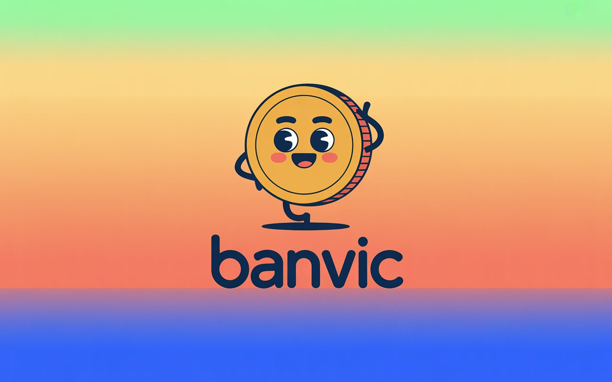

# Projeto de Análise de Dados do Banco Vitória

## Introdução:
Este projeto tem como foco a construção de um painel interativo no Power BI, como produto final, passando por etapas de pré-processamento, manipulação, modelagem e visualização de dados. Os dados utilizados pertencem a um banco fictício chamado Banco Vitória (ou “Banco Vic”).

## Arquitetura do Projeto:

## Justificativa:

No início, a instituição enfrenta diversos problemas relacionados à governança de dados, estando presa a métodos ultrapassados e a uma cultura conservadora entre os colaboradores. Diante desse cenário, surgiu a proposta deste projeto: apresentar um novo ponto de vista sobre como os dados podem ser trabalhados dentro da empresa, de forma mais moderna, eficiente e estratégica.

## Tecnologias Utilizadas:

  
   
  
  
  
  
  
  

## Datasets e seus Atributos:

| Dataset             | Variáveis                                                                                                                                                                                                                                                       | Descrição                                                                 |
|---------------------|----------------------------------------------------------------------------------------------------------------------------------------------------------------------------------------------------------------------------------------------------------------|----------------------------------------------------------------------------|
| Agencia             | cod_agencia, nome, endereco, cidade, uf, data_abertura, tipo_agencia                                                                                                                                                                                            | Informações sobre as agências bancárias. |
| Cliente             | cod_cliente, primeiro_nome, ultimo_nome, nome_completo, email, tipo_cliente, data_inclusao, cpfcnpj, data_nascimento, endereco, cep                                                                                                                              | Dados cadastrais e de identificação dos clientes.                |
| Colaborador_Agencia | cod_colaborador, cod_agencia                                                                                                                                                                                                                                    | Relação entre colaboradores e as agências em que trabalham.                 |
| Colaboradores       | cod_colaborador, primeiro_nome, ultimo_nome, nome_completo, email, cpf, data_nascimento, endereco, cep                                                                                                                                                           | Informações pessoais e de contato dos colaboradores.                        |
| Contas              | num_conta, cod_cliente, cod_agencia, cod_colaborador, tipo_conta, data_abertura, saldo_total, saldo_disponivel, data_ultimo_lancamento                                                                                                                           | Informações sobre contas bancárias. |
| Proposta_Credito    | cod_proposta, cod_cliente, cod_colaborador, data_entrada_proposta, taxa_juros_mensal, valor_proposta, valor_financiamento, valor_entrada, valor_prestacao, quantidade_parcelas, carencia, status_proposta                                                        | Propostas de crédito solicitadas por clientes. |
| Transacoes          | cod_transacao, num_conta, data_transacao, nome_transacao, valor_transacao                                                                                                                                                                                       | Registro de movimentações financeiras realizadas nas contas. |
| Clientes_Externos   | Numero_Linha, ID_Cliente, Sobrenome, Pontuação_Credito, Pais, Genero, Idade, Tempo_Relacionamento, Saldo, Numero_Produtos, Possui_Cartao_Credito, Membro_Ativo, Salario_Estimado, Saiu, Reclamou, Pontuaçao_Satisfaçao, Tipo_Cartao, Pontos_Acumulados           | Dataset externo com informações complementares de clientes de outro banco. |

## Etapas do Desenvolvimento:

- **Pré-processamento de Dados**:
  - **Ferramenta**: Python no Jupyter Notebook  
  - **Importação**: Carregamento dos arquivos de dados no ambiente do Visual Studio Code  
  - **Tratamento de valores nulos**: Identificação e substituição de valores faltantes  
  - **Transformação de dados**: Conversão de tipos para os formatos ideais (string, datetime, categórico)  
  - **Tratamento de duplicatas**: Verificação e remoção de registros duplicados para evitar inconsistências  
  - **Tradução de dataset**: Necessária apenas no dataset externo  
  - **Novas colunas**: Criação de variáveis adicionais conforme necessidade analítica  
  - **Dicionário de dados**: Desenvolvimento de dicionário com variáveis, descrições, tipos e subtipos de cada dataset  

- **Construção do Painel no Power BI**:
  - **Planejamento**: Identificação e organização dos dados a serem utilizados  
  - **Carregamento**: Upload dos dados pós-processados no Power BI  
  - **Criação de páginas**: Desenvolvimento de 7 páginas temáticas (Agências, Colaboradores, Clientes, Propostas de Crédito, Transações, Contas e Clientes Externos) e uma capa  
  - **Funcionalidades interativas**: Botões para limpar filtros, visualizar tabelas de dados, segmentadores em gráficos, filtros e navegação entre páginas  

- **Design de Layouts no Figma**:
  - **Ferramenta**: Figma  
  - **Layouts**: Produção dos layouts das páginas do relatório  
  - **Consistência visual**: Uso de paleta de cores da marca e logotipo fictício com diferentes tons  
  - **Mascote**: Criação do “Dolarinho”, moeda animada que representa a marca e está presente na logo  
  - **Integração**: Aplicação do design no painel do Power BI  

- **Documentação do Projeto**:
  - **Detalhamento**: Registro completo de todas as etapas do projeto  
  - **Clareza**: Explicação estruturada e objetiva sobre pré-processamento, construção do painel e design de layouts  
  - **Design**: Foco nas cores definidas no logotipo, aplicadas ao painel interativo para reforçar a identidade visual  

## Descrição do Painel:
<table>
  <tr>
    <td></td>
    <td></td>
  </tr>
</table>

<table>
  <tr>
    <td></td>
    <td></td>
  </tr>
</table>

<table>
  <tr>
    <td></td>
    <td></td>
  </tr>
</table>
<table>
  <tr>
    <td></td>
    <td></td>
  </tr>
</table>

- **Agências**:
  - Cartão com endereço (usado como filtro) e botões de interação (limpar filtros, alternar entre gráficos/tabelas).  
  - Indicadores: saldo total, saldo disponível, transações, contagem de agências, clientes e colaboradores.  
  - Filtros: tipo de agência, identificadores (cliente, agência, colaborador), datas (transação e abertura).  
  - Gráficos: mapas de saldo total e disponível por cidade; colunas + linha (valor e média de transações).  

- **Colaboradores**:
  - Cartão de contato como filtro, botões de interação (limpar filtros, gráficos/tabelas).  
  - Indicadores: propostas de crédito, valor de transações, valor de entrada, contagem de colaboradores.  
  - Filtros: identificadores (cliente, agência, colaborador, proposta) e data de nascimento.  
  - Gráficos: colunas comparativas (financiamento x transações), árvore hierárquica (status e carência), barras empilhadas (entrada x propostas).  

- **Clientes**:
  - Cartão de contato como filtro, botões de interação (limpar filtros, gráficos/tabelas).  
  - Indicadores: propostas de crédito, prestações, propostas, saldo, saldo disponível, financiamento, contagem de clientes.  
  - Filtros: identificadores (cliente, agência, colaborador, conta), datas (nascimento e inclusão).  
  - Gráficos: combinado (saldo x saldo disponível), linhas (evolução temporal), colunas comparativas (financiamento x parcelas).  

- **Propostas de Crédito**:
  - Botões de interação (limpar filtros, gráficos/tabelas).  
  - Indicadores: propostas de crédito, prestações, financiamento, entrada, parcelas, contagem de propostas.  
  - Filtros: identificadores (cliente, colaborador, proposta), parcelas e data de entrada.  
  - Gráficos: linhas (evolução de proposta, financiamento, entrada e prestações), árvore (quantidade x carência), funil (status das propostas).

- **Transações**:
  - Botões de interação: limpar filtros e alternar gráficos/tabelas.  
  - Indicadores: total, média e contagem de transações.  
  - Filtros: identificadores (cliente, agência, colaborador, conta, transação) e data da transação.  
  - Gráficos: comparativos de médias (dias da semana x todas as datas), linhas (quantidade por dia da semana x todas as datas) e barras (contagem e valor total por tipo de transação).  

- **Contas**:
  - Botões de interação: limpar filtros e alternar gráficos/tabelas.  
  - Indicadores: saldo total, saldo disponível, total de transações, médias (saldo e saldo disponível), contagem de contas.  
  - Filtros: identificadores (cliente, agência, colaborador, conta), datas (abertura da conta e último lançamento).  
  - Gráficos: linhas (saldo x saldo disponível – total e média, por data de lançamento e por data de abertura), dispersão (saldo total x saldo disponível por conta), barras (total de transações por conta).  

- **Clientes Externos**:
  - Botões de interação: limpar filtros e alternar gráficos/tabelas.  
  - Indicadores: contagem de clientes, médias (idade, produtos, pontos acumulados, salário estimado, saldo, satisfação, tempo de relacionamento).  
  - Filtros: identificadores (cliente), gênero, status (ativo/inativo), reclamações e posse de cartão de crédito.  
  - Gráficos: mapa (saldo por país), funil (satisfação de clientes ativos), barras (salário, produtos e saldo por cliente), treemap (distribuição por tipo de cartão).  

## Organização do Repositório:

------------
    ├── requirements.txt             <- O arquivo de requisitos para reproduzir o ambiente de análise, por exemplo, gerado com `pip congelamento > requisitos.txt
    │
    ├── LICENSE
    │
    ├── README.md                    <- O Readme de nível superior para desenvolvedores que usam esse projeto
    │ 
    ├── readme                       <- contém os arquivos de capa e arquitetura do projeto visualizados no readme.
    │
    │
    ├── Documentação                 <- Contém a apresentação em pdf com todas as etapas do projeto registradas.
    │
    ├── powerBI                      <- Contém os arquivos referentes à construção do Painel Interativo.
    │       ├── Arquivo              <- Contém o arquivo do Painel Interativo para ser baixado e rodado na própria máquina, através do Power BI Desktop.
    │       ├── Layouts              <- Contém os imagens utilizadas como fundo de parede nas páginas do Painel.
    │       ├── Relatorios           <- Contém capturas de tela das páginas do relatório do Power BI.
    │  
    ├── data                         <- Contém os datasets utilizados no projeto.
    │       ├── data-dictionary      <- Contém os dicionários de dados criados durante o projeto.
    │       ├── pos-processamento    <- Contém os datasets após toda a etapa de pré-processamento de dados, podendo ser utilizado no Power BI.
    │       ├── pre-processamento    <- Contém os datasets recebidos para realizar o projeto, sendo usados no pré-processamento dos dados.
    │
    └── notebooks                    <- caderno jupyter notebook utilizado para o pré-processamento de dados

## Conclusão:

- **Conclusão**:
  - **Pré-processamento**: Fase fundamental para garantir a qualidade dos dados. Verificação de valores nulos, duplicatas, transformações e exploração detalhada evitou inconsistências e permitiu análises confiáveis.  
  - **Relatório no Power BI**: Dados organizados em visualizações claras e interativas, com páginas segmentadas conforme tabelas e relacionamentos, facilitando a interpretação e geração de insights. Segmentadores tornam a navegação mais intuitiva e ágil.  
  - **Design e identidade visual**: Cores extraídas do banner oficial e utilização do mascote “Dolarinho” garantiram coerência estética e experiência agradável ao usuário.  
  - **Documentação e apresentação**: Registro completo de todas as etapas, integrando pré-processamento, construção do relatório e design. Template adaptado no Canva reforçou a identidade visual e a consistência entre apresentação e relatório.

